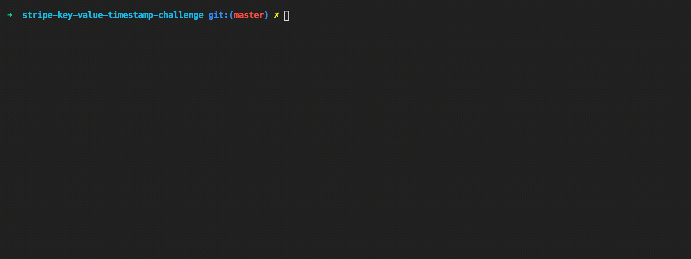

# Stripe Key-Value-Timestore Challenge

A CLI tool to perform data manipulations to a JSON data store.

- [Requirements](#requirements)
- [Install](#install)
- [Usage](#usage)
- [Commands](#commands)
- [Demo](#demo)
- [Contribute](#contribute)

# Requirements

- Node: `brew install node` or [Node docs](https://nodejs.org/en/)

# Install

- Clone repo: `git clone git@github.com:agdavid/stripe-key-value-timestamp-challenge.git`
- `npm install`

# Usage

##### 📌 `node index.js <COMMAND NAME> [OPTIONS]` 📌


```bash
$ node index.js --help

$ node index.js add --key=<someStringKey> --value=<someStringValue>

$ node index.js find --key=<someStringKey>

$ node index.js find --value=<someStringValue>

$ node index.js find --timestamp=<someNumberTimestamp>

$ node index.js remove --key=<someStringKey> --timestamp=<someNumberTimestamp>

$ node index.js list
```

# Commands

### 1. Help | `--help`

##### Description:

Get basic usage info for all provided CLI scripts.

##### Usage:

```shell
node index.js --help
```

or

```
node index.js -h
```

### 2. Add | `add`

##### Description:

Add object to the JSON data store.

##### Usage:

```shell
node index.js add --key=<key> --value=<value>
```

##### Options:

- `<key>` | Required
- `<value>` | Required

### 3. Find | `find`

##### Description:

Find objects in the JSON data store that match the provided optional parameters.

##### Usage:

```shell

node index.js find --key=<key> --value=<value> --timestamp=<timestamp>
```

##### Options:

- `<key>` | Optional | Key of the JSON objects to locate.
- `<value>` | Optional | Value of the JSON objects to locate.
- `<timestamp>` | Optional | UNIX timestamp of JSON objects to locate.

##### Notes:

- If no `<key|value|timestamp>` are provided, command will return all objects in JSON data store.


### 4. Remove | `remove`

##### Description:

Remove object matching the required key and timestamp parameters

##### Usage:

```shell
node index.js remove --key=<key> --timestamp=<timestamp>
```

##### Options:

- `<key>` | Required
- `<timestamp>` | Required

# Demo


# Contribute

## Develop
- Run `node index.js <command_name> [options]` to test various commands/options.
- Write code!
- Please use [git-flow](https://github.com/nvie/gitflow) and commit your changes on a feature branch, rebase it on develop branch before finishing the feature, then issue pull request to develop branch
